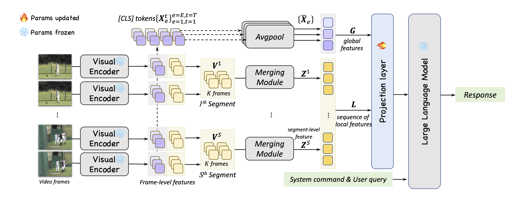
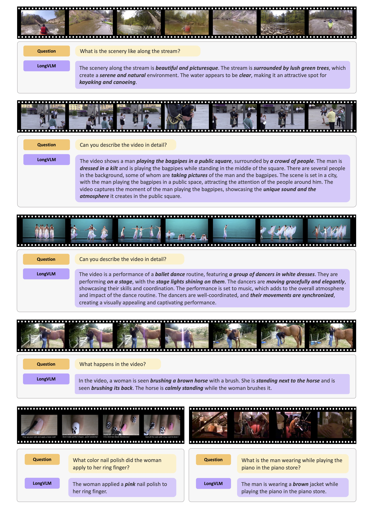
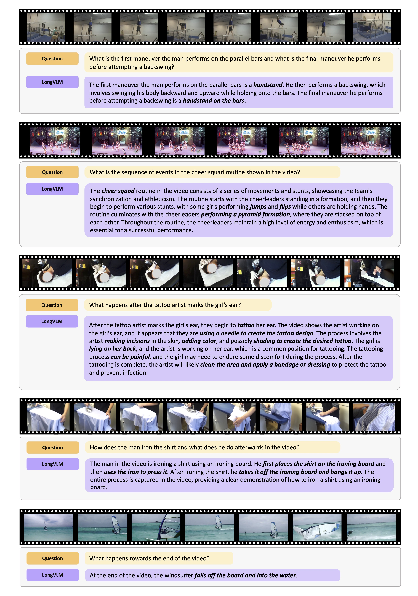
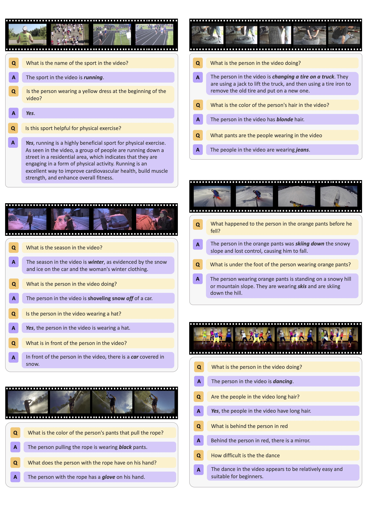
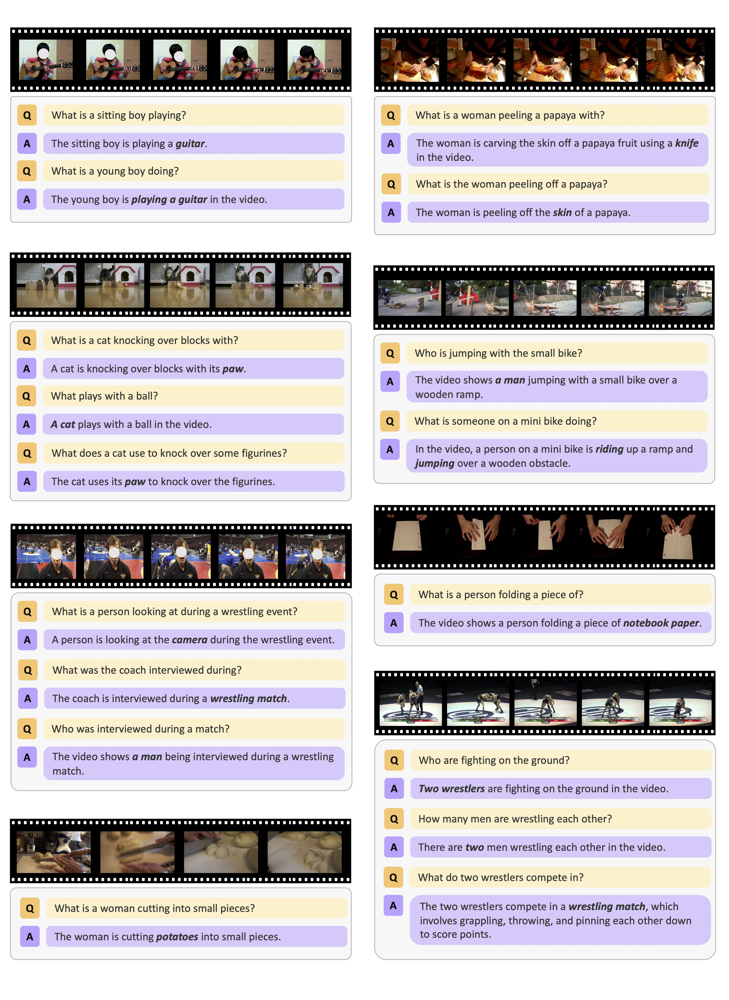

<h1 align="center">LongVLM: Efficient Long Video Understanding via Large Language Models</h1> 

**[ECCV 2024] This is the official repository for our paper:** [LongVLM: Efficient Long Video Understanding via Large Language Models](https://arxiv.org/abs/2404.03384) by Yuetian Weng, Mingfei Han, Haoyu He, [Xiaojun Chang](https://www.xiaojun.ai/) and [Bohan Zhuang](https://bohanzhuang.github.io/). 


## Architecture



## Installation
```
conda create -n longvlm python==3.9
pip install torch==1.10.1+cu111 torchvision==0.11.2+cu111 torchaudio==0.10.1
pip install -r requirements.txt
export PYTHONPATH="./:$PYTHONPATH"

### For Training, install flash-attention
pip install ninja
git clone https://github.com/HazyResearch/flash-attention.git
cd flash-attention
git checkout v1.0.7
python setup.py install
```

## Pretrained model
Download pretrained base model and delta weights from [Huggingface](https://huggingface.co/docs/transformers/main/model_doc/llama).

Apply delta weights to the base model:
```
python scripts/apply_delta.py \
    --base YOUR_PATH_TO_LLAMA_7B \
    --target YOUR_PATH_TO_LLAVA_7B \
    --delta YOUR_PATH_TO_LLAVA_DELTA_7B
```


## Data preparation
Download ActivityNet dataset. Dataset architecture: 
```
datasets
|___anet
|   |___v1-2/
|   |   |___train/
|   |   |   |___xxxx.mp4
|   |   |   |___xxxx.mp4
|   |   |___val/
|   |   |   |___xxxx.mp4
|   |   |   |___xxxx.mp4
|   |___v1-3/
|   |   |___train_val/
|   |   |   |___xxxx.mp4
|   |   |   |___xxxx.mp4
|   |___anet_benchmark_video_id.txt
|   |___video_list_v1_2_val.txt
|   |___video_list_v1_2_train.txt
|   |___video_list_v1_3_trainval.txt
```

Extract visual features using CLIP-VIT/L-14:
```
python scripts/save_features.py \
    --video_dir_path YOUR_PATH_TO_VIDEO_FOLDER \
    --list_file YOUR_PATH_TO_VIDEO_ID_FILE \
    --clip_feat_path_local YOUR_PATH_TO_SAVE_VISUAL_FEATURE_L \
    --clip_feat_path_mem YOUR_PATH_TO_SAVE_VISUAL_FEATURE_G
```

## Train and Evaluation
```
sh run.sh
```

## Examples







## Acknowledgement
This work is built upon [VideoChatGPT](https://github.com/mbzuai-oryx/Video-ChatGPT). Thanks to their awesome work.